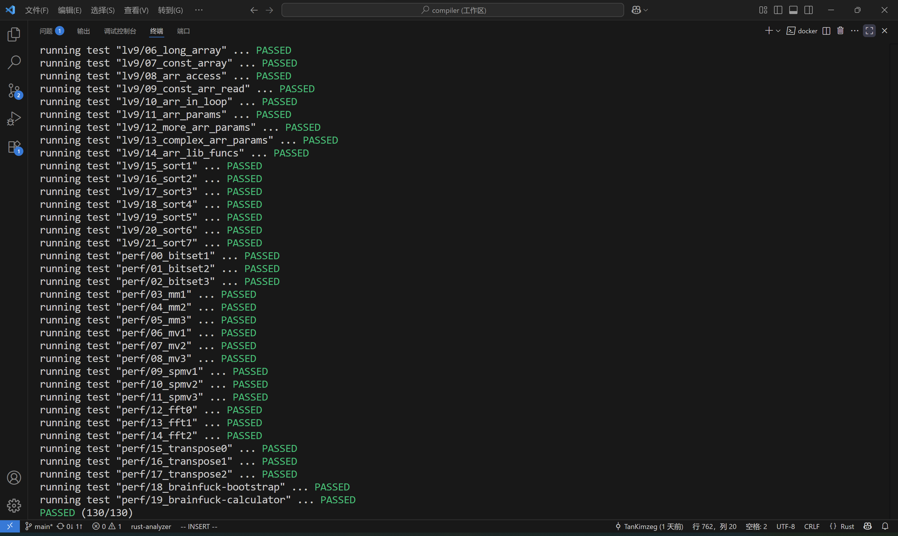

# 北京大学编译原理实践 —— SysY 编译器

PKU 编译原理实践课程工程代码, 目标语言为 [Koopa IR](https://docs.rs/koopa/latest/koopa/index.html) 与 RISC-V.工程使用 Rust 实现, 语法前端基于 [lalrpop](https://docs.rs/crate/lalrpop/latest) .



[课程文档](https://pku-minic.github.io/online-doc/)

## 构建与运行

- 构建:

```shell
cargo build
```

- 运行编译器:

```shell
# 生成 Koopa IR 到输出文件
cargo run -- -koopa <source.c> -o <out>

# 生成 RISC-V 汇编到输出文件
cargo run -- -riscv <source.c> -o <out>

# RISC-V 性能测试模式
cargo run -- -perf <source.c> -o <out>
```

## 测试

除了docker容器中的`autotest`外,在 `tests` 目录下还可以运行测试单例:

- Koopa IR:

  ```sh
  cd tests
  make MODE=koopa SRC=./lisp.c 2>/dev/null
  ./build/lisp < input.lisp
  ```

- RISC-V 汇编:

  ```sh
  cd tests
  make MODE=riscv SRC=./lisp.c 2>/dev/null
  qemu-riscv32-static ./build/lisp < input.lisp
  ```

## 项目结构

```text
.
├─ Cargo.toml
├─ build.rs
├─ assets/
│  └─ passed.png
├─ src/
│  ├─ main.rs
│  ├─ lib.rs
│  ├─ sysy.lalrpop
│  ├─ converter.rs
│  ├─ koopa_compiler.rs
│  ├─ riscv_compiler.rs
│  └─ ast/
│     ├─ mod.rs
│     ├─ block.rs
│     ├─ decl.rs
│     ├─ exp.rs
│     ├─ func.rs
│     └─ stmt.rs
└─ tests/
   ├─ Makefile
   ├─ lisp.c
   └─ input.lisp
```
